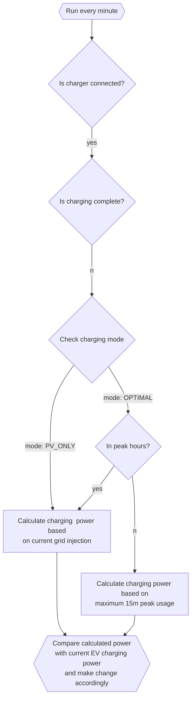
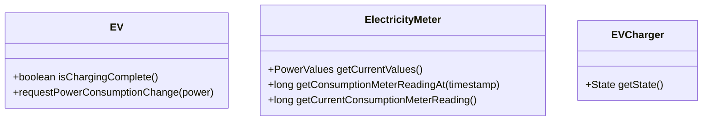

# EV Charging

This project automates EV charging using the following constraints:
- use as much self-produced solar energy as possible
- limit grid usage at peak hours
- keep the "15 min peak" as low as possible (Belgian 'capaciteitstarief')

On a high level, it works like this:



## Concepts

The correct functioning of this project relies on these concepts:
- EVCharger: to check if the car is connected
- ElectricityMeter: the retrieve current and historical power meter values
- EV (electric vehicle): to start and stop charging and to change charging power

All three are abstracted in interfaces:



By default, they are implemented by
- EVCharger: connecting to an SMA charger using it's web admin UI (local IP).
- ElectricityMeter:  connecting to an SMA Inverter (Sunny Boy) using it's web admin UI (local IP).
- EV: connecting to the Tesla REST API

These implementations need configuration (like credentials). More on that below.

If you're interested in this project but have a different charger, electricity meter or EV, you can add another custom implementation for one or more of these interfaces.

This project is designed to be always on, e.g. on a Raspberry Pi, and run every minute. Alternatively it could also work if started for as long as the EV is connected to the charger.
The charger connection state can also be retrieved from the `EV` but it seemed better not having to query the EV every minute (even if not connected).


## Running the application in dev mode

This project is written in Java and uses Quarkus. You can run your application in dev mode that enables live coding using:
```shell script
./mvnw compile quarkus:dev
```

## Packaging and running the application

The application can be packaged using:
```shell script
./mvnw package
```
It produces the `quarkus-run.jar` file in the `target/quarkus-app/` directory.

The application is now runnable using `java -jar target/quarkus-app/quarkus-run.jar`.


## Status page

This project serves an HTTP status page using at:
http://your.local.ip:8080/status

It outputs current settings and power values:

```text
EVCharging Status

Operating mode	     OPTIMAL
Max 15 min peak	     4000W
Charger state	     Waiting
From grid	         344W
To grid	             0W
From PV	             0W
Total consumption	 344W
```

And it allows to switch charging mode between 3 states:
- OFF
- PV_ONLY
- OPTIMAL


## Configuration

### General

There are 2 important inital configuration settings that are set in `config/application.properties`:

- max15minpeak: EV charging will be limited so the 15 min average peak usage will be below this value
- mode: 
  - `OFF`: do nothing
  - `PV_ONLY`: only use power that was otherwise injected to the grid
  - `OPTIMAL`: in peak hours same as `PV_ONLY`. otherwise, use as much power as possible, but keep the 15 min average under the configured `max15minpeak` value.

```properties
max15minpeak=4000
mode=OPTIMAL
```

Both values can be changed at runtime at the status page (see above).

Furthermore, it makes sense to enable FINE logging in the `.env` file:
```properties
quarkus.log.level=INFO
quarkus.log.category."evcharging".level=FINE
```

### SMA Charger

When using `SMACharger` as the `EVCharger` implementation, these settings must be set in `.env`:

```properties
EVCHARING_CHARGER_IP=x.x.x.x
EVCHARING_CHARGER_USERNAME=...
EVCHARING_CHARGER_PASSWORD=...
```

### SMA Inverter

When using `SMAInverter` as the `ElectricityMeter` implementation, these settings must be set in `.env`:

```properties
EVCHARING_INVERTER_IP=x.x.x.x
EVCHARING_INVERTER_PASSWORD=...
```

### Tesla

When using `TeslaEV` as the `EV` implementation, the tesla refreh token must be set in `.env`:

```properties
EVCHARING_TESLA_REFRESHTOKEN=...
```

To obtain a refresh token, please refer to [detailed information about Tesla API authentication](https://tesla-api.timdorr.com/api-basics/authentication) or use a tool like [Tesla Access Token Generator](https://chrome.google.com/webstore/detail/tesla-access-token-genera/kokkedfblmfbngojkeaepekpidghjgag)


### Slack notification service

This project can send administrative notifications via slack. You need to add these settings to `.env` if you want to use it:

```properties
EVCHARGING_SLACK_URL=https://hooks.slack.com/services/...
EVCHARGING_SLACK_CHANNEL=...
```